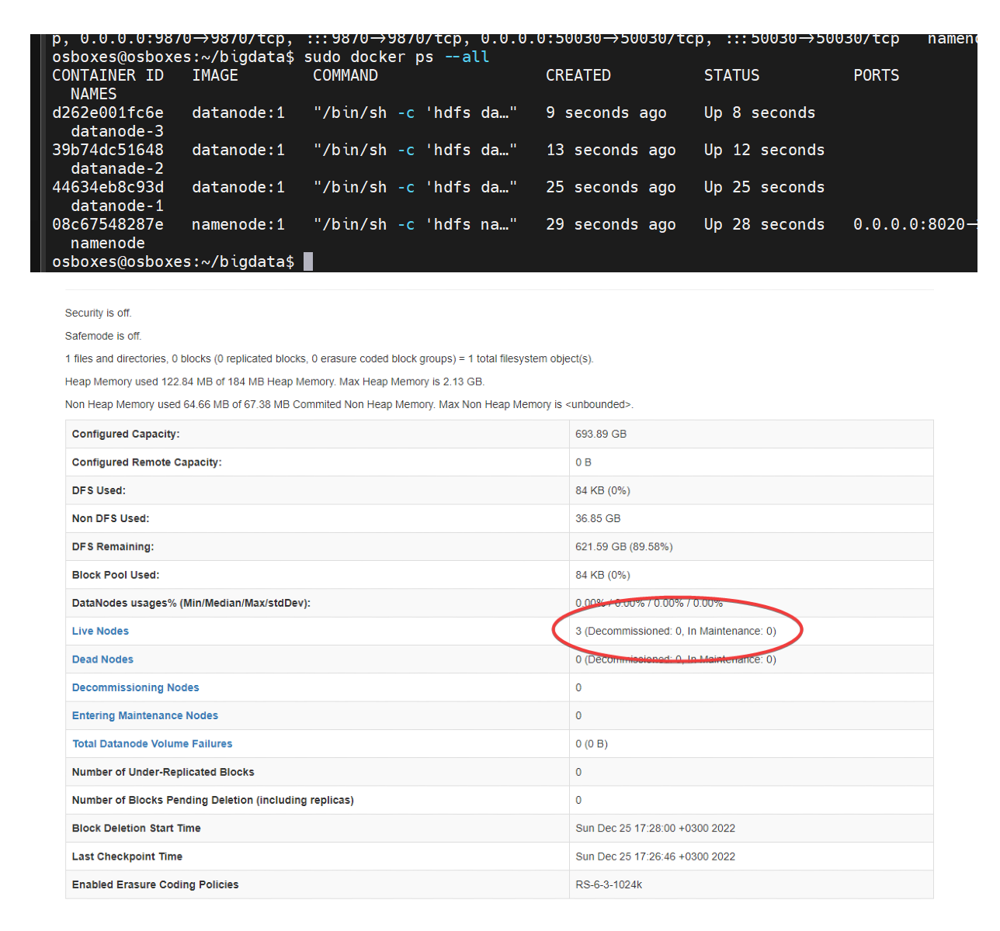
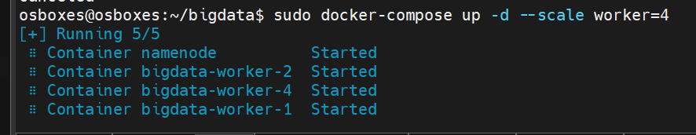

# hadoop-hdfs-lysak

Домашняя работа по дисциплине "Интеллектуальные системы и технологии".

# Описание работы

Для выполнения задания я выбрал базовый образ Ubuntu Server 20.04.4 Focal Fossa.
Образ для VirtualBox с сайта [osboxes.org](https://www.osboxes.org/ubuntu/).

Использую сетевой мост в качестве адаптера (получаю IP в реальной сети), подключаюсь из SSH-клиента MobaXTerm для
удобства работы с файлами, редактирую в JetBrains DataSpell.

Я использую образ [openjdk:11](https://hub.docker.com/_/openjdk), основанный на ядре OracleLinux. Основное преимущество
для данной работы заключается в предустановленном OpenJDK11.

Изначально я использовал [alpine:latest](https://hub.docker.com/_/alpine), но не получилось, т.к. возникли сложности с
установкой ``JAVA_PATH``.

## Поэтапное выполнение

1. Установка SSH-сервера для подключения к машине;

```
sudo apt update
sudo apt install openssh-server
sudo systemctl status ssh
sudo ufw allow ssh
```

2. Установка необходимого ПО, скачивание Hadoop 3.3.4 (последняя версия) и ~~JDK 11.0.17 (JAVA 11)~~ переношу по SSH;

```
wget https://dlcdn.apache.org/hadoop/common/hadoop-3.3.4/hadoop-3.3.4.tar.gz
```

3. Создаю файловую структура для проекта;
4. Загрузка необходимых файлов конфигурации ```hadoop``` для базовой ```node``` ([core-site.xml](config%2Fcore-site.xml)
   и [hadoop-env.sh](config%2Fhadoop-env.sh));
5. Конфигурация [namenode](hdfs-nodes%2Fnamenode%2Fconfig) и [datanode](hdfs-nodes%2Fdatanode%2Fconfig);
6. Написание и сборка основного [Dockerfile](..%2FDockerfile) (*оставил комментарии от предыдущих попыток*);

```
sudo docker build . -t base-image:1
```

7. Написание и сборка [datanode Dockerfile](hdfs-nodes%2Fdatanode%2FDockerfile)
   и [namenode Dockerfile](hdfs-nodes%2Fnamenode%2FDockerfile);

```
sudo docker build hdfs-nodes/namenode -t namenode:1
sudo docker build hdfs-nodes/datanode -t datanode:1
```

8. После успешной сборки 2 конечных контейнеров можно произвести запуск кластера, создав сеть ```hadoop_network``` и
   запуская последовательно все ```node```:

```
sudo docker network create hadoop_network
sudo docker run -d --net hadoop_network --hostname namenode-master -p 9870:9870 -p 50030:50030 -p 8020:8020 --name namenode namenode:1
sudo docker run -d --net hadoop_network --name datanode-1 datanode:1
sudo docker run -d --net hadoop_network --name datanade-2 datanode:1
sudo docker run -d --net hadoop_network --name datanode-3 datanode:1
```

9. В конечном этоге получается 1 ```namenode``` и 3 ```datanode```. Демонстрация на скриншоте:
   
10. Для удобства написал скрипт для запуска [start.sh](..%2Fstart.sh);
11. Также для полноценной работы создал [docker-compose.yml](..%2Fdocker-compose.yml);
12. Скриншот запуска клестера из 4 ```worker```:


